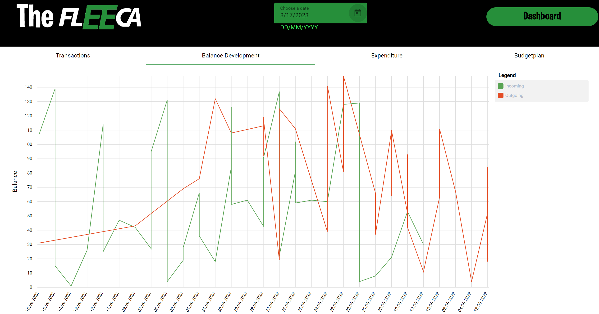
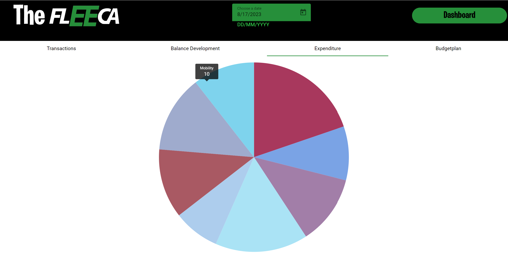
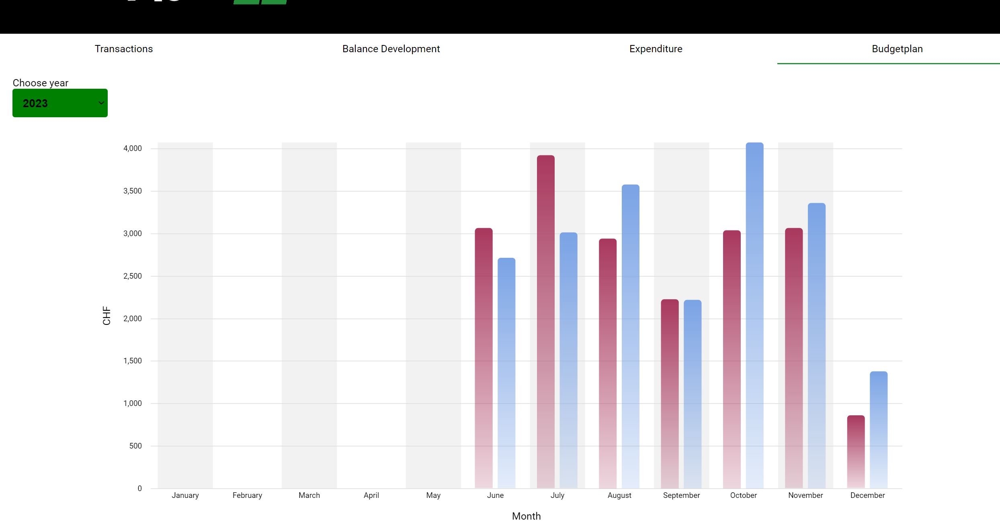

# The Fleeca

## Usage
Go into the client and run it
```
npm i
cd client
npm run start
```
Then go into the server and run it
```
npm i
cd server
npm run start
```

## Description
The Fleeca references the bank in GTA V, which is named fleeca. This is an angular website for the fleeca bank in which you can complete mock transactions with other users which have an account on the website, by entering their account number. 

## Features
You can log into and register into an account. After registering you're allowed to access the dashboard in which you can send an amount to another user, as long as their account number exists. In the right you can see a table showing your recent incoming and outgoing transactions. You can sort them by each table heading.  
If you click the statistics button in the header in the dashboard, you get redirected to a page where you can view some statistics to your transactions.   
You can view the **development of your balance** in a line chart, which displays the incoming and outgoing amounts as lines in the chart.   
Additionally, you can view a piechart of the **expenditure** ordered into each category of the transaction.   
Finally, you can see a bar chart displaying your **expenditure and income** for each month. This chart should act as a budget plan, with which you can see how much you earn versus how much you spend each month.   
You can filter all the chart and table data by a date, which then displays the data from that day + 1 month.  
The budgetplan is filtered yearly.

### Balance Development
<p align="center">
  
</p>

### Expenditure
<p align="center">
  
</p>

### Budgetplan
<p align="center">
  
</p>
